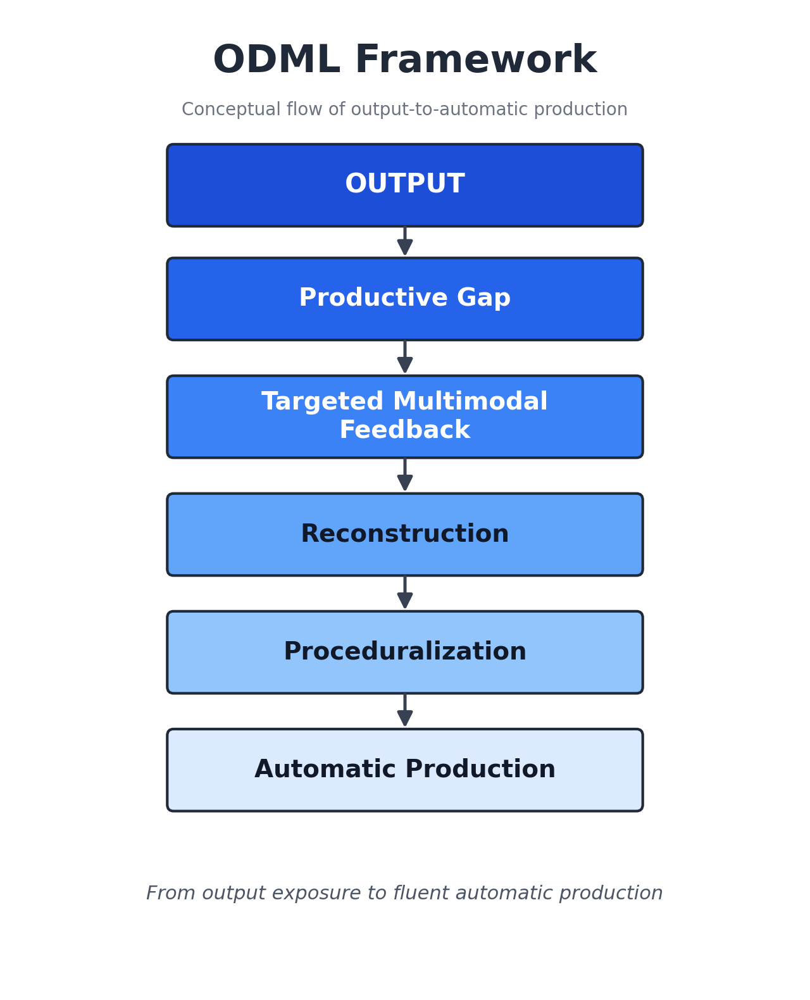
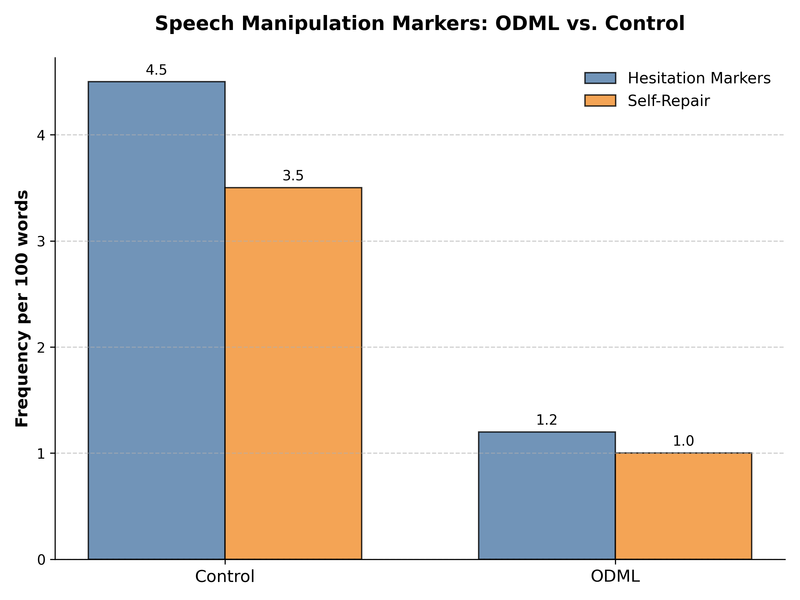

# Output-Driven Multilingual Learning Promotes Long-Term Linguistic Accuracy  
## Evidence from a Longitudinal Linear Mixed-Effects Study

[](#the-odml-framework)
[](#statistical-analysis)
[](#repository-structure)
[](#citation)

This repository documents the study **“Output-Driven Multilingual Learning Promotes Long-Term Linguistic Accuracy: Evidence from a Longitudinal Linear Mixed-Effects Study.”**  
The project evaluates the **Output-Driven Multilingual Learning (ODML)** framework against conventional **input-first instruction** in a longitudinal randomized controlled design.

The study examines whether requiring multilingual learners to produce language output **before** receiving targeted input improves:

- long-term linguistic accuracy
- speech onset latency
- cognitive workload
- productive difficulty markers such as pauses and self-repairs

---

## Graphical Abstract

<p align="center">
  
</p>

---

## Project Overview

This repository supports a longitudinal study with four measurement occasions:

1. **Pre-test**
2. **Immediate post-test**
3. **One-week delayed post-test**
4. **One-month delayed post-test**

Participants were randomly assigned to one of two groups:

- **ODML experimental group**: $n = 30$
- **Input-first control group**: $n = 30$

All randomized participants completed the study, yielding **0% attrition**.

---

## The ODML Framework

ODML proposes that instructional sequencing should begin with **output production**, thereby creating a **productive linguistic gap** that increases attention, self-monitoring, and deeper processing before targeted input is provided.

### ODML sequence
**Output → Linguistic Gap → Targeted Input → Subsequent Production**

### Control sequence
**Input → Explanation → Practice → Production**

<p align="center">
  
</p>

---

## Study Design

### Participants
- Initial screening: **68** individuals
- Excluded: **8**
  - **4** failed inclusion criteria
  - **4** declined participation
- Final sample: **60 multilingual university students**

### Inclusion criteria
- Intermediate to upper-intermediate proficiency
- Approximately **CEFR B2**
- No diagnosed language or neurological disorders
- No prior exposure to the experimental materials

### Intervention
- **Task-Based Language Teaching (TBLT)** framework
- **8 sessions**, each **60 minutes**
- Conducted over **4 consecutive weeks**
- Same target structures, classroom setting, instructor, and practice opportunities for both groups
- Only the instructional sequence differed

### Timeline
- **Weeks 1–2**: recruitment, screening, pre-test
- **Weeks 3–6**: intervention
- **End of Week 6**: immediate post-test
- **Week 7**: one-week delayed post-test
- **Week 10**: one-month delayed post-test

---

## Outcomes and Measures

### Primary outcome
- **Linguistic accuracy**
  - percentage of correctly produced target structures in oral and written tasks

### Secondary outcomes
- Lexical retrieval latency
- Speech onset latency measured in **Praat**
- Weighted **NASA-TLX** cognitive workload
- Filled pauses
- Silent pauses
- Self-repair attempts
- Reformulation frequency

### Reliability and validity
- Two blind raters scored oral production samples
- Inter-rater reliability threshold: **ICC ≥ .85**
- Observed linguistic-accuracy reliability: **ICC = .89**
- Content validity: **S-CVI/Ave = .93**
- Three specialists reviewed instructional materials
- 20% of instructional sessions were independently observed for fidelity

---

## Key Results

<p align="center">
  
</p>

### Linguistic accuracy
The ODML group outperformed the control group over time, with the strongest advantage at delayed assessment.

- **Instructional Method × Time interaction**:  
  $\beta = 0.65$, $SE = 0.11$, $t = 5.91$, $p < .001$
- **Marginal $R^2$**: .31
- **Conditional $R^2$**: .67

### Descriptive means for linguistic accuracy
| Time point | ODML | Control |
|---|---:|---:|
| Pre-test | 3.12 (0.42) | 3.08 (0.45) |
| Immediate post-test | 3.88 (0.51) | 3.32 (0.48) |
| One-month delayed | 4.15 (0.58) | 3.45 (0.52) |

### Pairwise comparisons
- ODML vs. control at immediate post-test:  
  $\beta = 0.31$, $SE = 0.12$, $p = .012$
- ODML vs. control at delayed post-test:  
  $\beta = 0.58$, $SE = 0.13$, $p < .001$

---

## Speech Onset Latency

ODML reduced speech onset latency over time, indicating more efficient processing.

- **Instructional Method × Time interaction**:  
  $\beta = -1.12$, $SE = 0.24$, $t = -4.67$, $p < .001$
- **Marginal $R^2$**: .28
- **Conditional $R^2$**: .63

### Approximate pattern
- ODML: ~1180 ms at pre-test, ~850 ms immediate post-test, ~720 ms delayed
- Control: ~1120–1150 ms across assessments

---

## Cognitive Load (NASA-TLX)

<p align="center">
  
</p>

The ODML condition produced **higher short-term workload** during the intervention but **lower delayed workload**, suggesting desirable difficulty followed by consolidation.

- **Instructional Method × Phase interaction**:  
  $\beta = -1.25$, $SE = 0.41$, $t = -3.05$, $p = .004$
- **Intervention-phase difference**:  
  $\beta = 20.30$, $SE = 3.78$, $p < .001$
- **Delayed post-test difference**:  
  $\beta = -7.30$, $SE = 2.40$, $p = .004$

### Approximate workload pattern
- ODML during intervention: ~65
- Control during intervention: ~40
- ODML delayed: ~30
- Control delayed: ~38

---

## Manipulation Check

The intervention successfully induced greater productive difficulty in the ODML condition.

| Behavioral outcome | β | SE | t | 95% CI | p |
|---|---:|---:|---:|---|---:|
| Hesitation markers per 100 words | 2.15 | 0.41 | 5.26 | [1.33, 3.00] | < .001 |
| Self-repair attempts per 100 words | 1.95 | 0.40 | 4.88 | [1.15, 2.75] | < .001 |

These findings support the interpretation that ODML increased communicative effort and self-monitoring during output phases.

---

## Statistical Analysis

Analyses were conducted in **R** using **lme4**.

### Model structure
The primary model followed a longitudinal linear mixed-effects specification:

$$
Outcome \sim InstructionalMethod \times Time + (1 | Participant) + (1 | Item)
$$

Where supported by convergence and model comparison, random slopes for **Time** were considered.

### Fixed effects
- Instructional Method: ODML vs. Input-first
- Time: pre-test, immediate post-test, one-week delayed, one-month delayed
- Instructional Method × Time interaction

### Random effects
- Random intercepts for participants
- Random intercepts for items
- Optional random slopes for time

### Inference and diagnostics
- Residual plots
- Q–Q plots
- Residuals vs fitted values
- Standardized residual diagnostics
- Bonferroni-adjusted pairwise comparisons of estimated marginal means
- Significance threshold: $p < .05$
- Reported effect metrics: $\beta$, $SE$, $95\%\,CI$, $p$
- Model fit: marginal and conditional $R^2$

---

## Important Reporting Note

This repository preserves the manuscript’s reported values as documented, but several internal inconsistencies should be noted:

- Cognitive workload is reported as **$\beta = 20.30$** in the detailed results, while a summary table lists a much smaller value for the same comparison.
- Some sections refer to **four time points**, while others describe **three phases**.
- The text uses slightly different labels for the speech-manipulation indicators.
- The exact executable R formula, optimizer settings, contrast coding, and raw model objects are not included in the manuscript text.

Because of this, users should verify the results directly from the project data before treating the numbers as independently reproduced estimates.

---

## Repository Structure
```text
ODML-Cognitive-Processing-Analysis/
├── Figures/
│   ├── graphic abstract.png
│   ├── odml_framework.png
│   ├── odml_key_results.png
│   └── speech_manipulation_markers.png
├── data/
│   ├── raw/
│   └── processed/
├── scripts/
│   ├── 01_preprocessing.py
│   └── 02_lmm_analysis.R
├── README.md
└── pasted-text.txt
